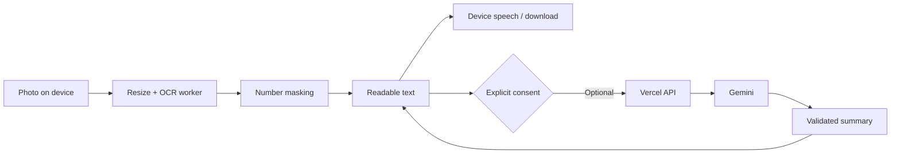

<div align="center">
  
  <h1>Penny</h1>
  <p><strong>Every letter. A little clearer.</strong></p>
  <p>An accessible letter reader with on-device OCR, voice navigation,<br />and a playground for more inclusive financial interfaces.</p>
  <p>
    <a href="https://joshbeira.github.io/Penny/">Open Penny</a> ·
    <a href="docs/USER_GUIDE.md">User guide</a> ·
    <a href="docs/ARCHITECTURE.md">Architecture</a> ·
    <a href="https://github.com/joshbeira/Penny/issues/new?template=feedback.yml">Give feedback</a>
  </p>
  <p>
    <a href="https://github.com/joshbeira/Penny/actions/workflows/ci.yml"></a>
    
    
  </p>
</div>


## Why Penny

A letter should not become a barrier because its type is small or its layout is hard to follow. Penny turns photographs of printed English letters into readable, downloadable text, with speech output and controls designed for keyboard and screen-reader access.

The useful path works without an account or an AI subscription: open Post Box, photograph a letter, and read it on your device. The public GitHub Pages beta uses local processing only. Optional AI summaries are available on configured server deployments and require an explicit choice to share the recognised text.

**Public beta:** ready for people to try and help improve. Accessibility checks are automated, but usability with assistive technology needs ongoing testing with people. Penny is an independent project, not a banking service. The account, payments and card-order flows are clearly labelled simulations using sample data.

## What you can do

| Capability                          | How it works                                                                                                                |
| ----------------------------------- | --------------------------------------------------------------------------------------------------------------------------- |
| **Read your own letters**           | Tesseract OCR runs in a browser worker. Failed recognition shows an error; it never substitutes a sample letter.            |
| **Listen, read or download**        | Large text, installed on-device voices, stop/repeat controls and plain-text export.                                         |
| **Choose when to use AI**           | Review recognised text, explicitly consent, then request a summary or explanation through a server-side Gemini integration. |
| **Use the reader offline**          | The installable PWA caches its OCR engine and English language data after the first completed online load.                  |
| **Explore accessible interactions** | Voice navigation, Quiet Mode, haptic feedback, transaction sonification and a read-back-before-confirmation flow.           |
| **Inspect action receipts**         | Sandbox actions create SHA-256 hash-linked receipts with verification, JSON export and deletion.                            |

## Try it in a minute

1. Open [Penny](https://joshbeira.github.io/Penny/) and tap to start.
2. Choose **Read a letter**, then **Try a sample letter**. No camera or personal document is required.
3. Try **Read aloud**, **Stop reading** and **Download text**.
4. Photograph a clear, non-sensitive printed English letter to try the real OCR flow.
5. [Tell me what worked or got in your way](https://github.com/joshbeira/Penny/issues/new?template=feedback.yml). Please do not attach personal letters.

Read-aloud needs an installed English device voice. Voice input depends on browser support and may use the browser provider's online recognition service. See [the user guide](docs/USER_GUIDE.md) for installation and troubleshooting.

## Run locally

Use **Node.js 22.18+** and npm. No environment variables are needed for local reading.

```sh
git clone https://github.com/joshbeira/Penny.git
cd Penny
npm ci
npm run dev
```

Open the local URL printed by Vite. For an installable production build:

```sh
npm run build
npm run preview
```

Vite serves the frontend only. Optional AI summaries use the Vercel function in `api/read-letter.ts`; see [deployment](docs/DEPLOYMENT.md) for server configuration. The reader stays usable when that endpoint is disabled or unavailable.

## Engineering decisions

- **Local processing first.** Images are decoded, resized and recognised in the browser. Photos never reach Penny's API. OCR failure closes the processing path with an actionable error.
- **Explicit trust boundary.** Cloud calls send only the text the user reviewed, after consent. The API validates input and model output, imposes size limits and timeouts, and preserves the original transcription.
- **Multimodal accessibility.** Speech, visible text, live announcements, keyboard controls and haptics share the same interaction state. Quiet Mode suppresses spoken output while retaining visible feedback.
- **Accessibility regression checks.** Playwright compares reviewed accessibility-tree snapshots on five routes. Axe checks for serious and critical violations; browser tests cover the real reader workflow.
- **Verifiable local state.** Receipt writes are serialised so simultaneous actions cannot fork the hash chain. Verification detects inconsistent edits; it is not a cryptographic proof against a person who can rewrite the entire local store.



## Project layout

```text
api/                 Optional server-side AI endpoint
src/
  components/        Shared controls, dialogs, speech feedback and navigation
  screens/           Home, Post Box, Receipts, Settings and accessibility preview
  lib/               OCR, speech, intent matching, validation and hashing
  state/             Settings, session and receipt stores
  data/              Explicitly synthetic banking examples
public/              PWA icons, fixed voice clips and self-hosted OCR assets
tests/e2e/           Browser journeys, OCR, offline and accessibility tests
tests/unit/          Server request and response contract tests
ci/layout-lock/      Reviewed accessibility-tree baselines
docs/                User guide, architecture, privacy and beta research plan
.github/             Continuous integration and contribution templates
```

## Quality checks

```sh
npm run typecheck
npm test
npm run build
npx playwright install chromium
npm run test:e2e
npm run lock:check
```

Tests exercise redaction and response validation, consent handling, failure recovery, receipt tampering and concurrent writes, actual image recognition, offline startup, and key user journeys. CI runs on every push and pull request. These checks support development; they do not establish WCAG conformance or replace human assistive-technology testing.

## Privacy and limits

Penny has no application analytics, accounts or document database. Photos and recognised letters stay in memory until you clear them or leave the reader. Settings and practice receipts persist in browser storage. Optional AI summaries share text with Google; hosting and browser providers may process technical request data. [Read the data flow and limitations](docs/PRIVACY.md).

Number masking is heuristic: it can miss sensitive details and hide useful numbers such as dates. English print is supported; handwriting, PDFs, complex layouts and other languages are not supported as reliable inputs. Always check important names, amounts and dates. There is no connection to a bank, no transfer of money, and no automatic scam reporting.

## Build it with users

The next milestone is a small, documented usability study with people who find everyday post difficult to read. [The beta plan](docs/BETA.md) defines tasks, consent, feedback and success measures; [the roadmap](docs/ROADMAP.md) tracks work that follows from that evidence.

Useful contributions include accessibility reports, reproducible OCR failures using synthetic documents, browser compatibility findings and focused fixes. Start with [CONTRIBUTING.md](CONTRIBUTING.md).

Built and maintained by [Josh Beira](https://github.com/joshbeira).
