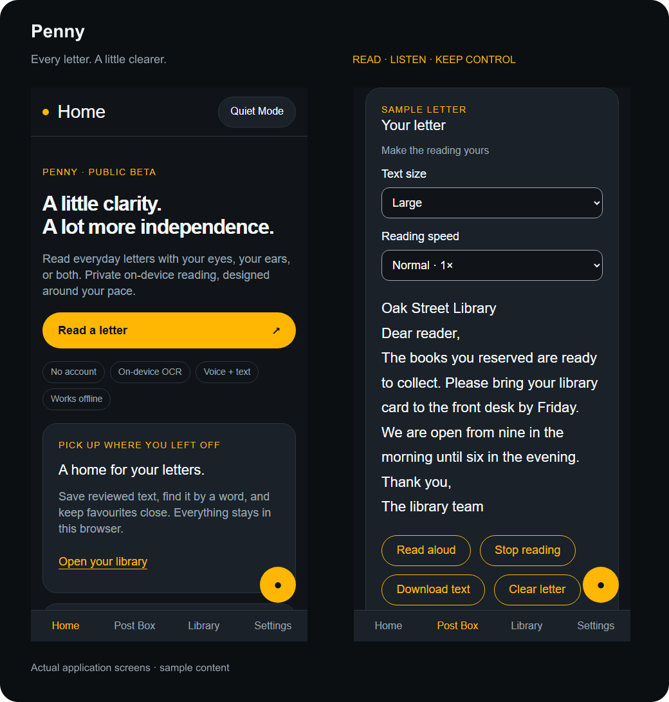
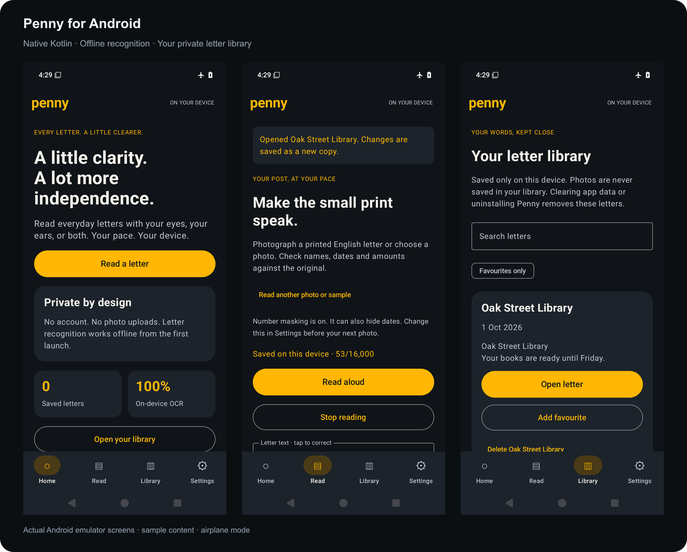
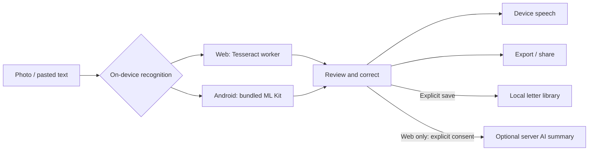

<div align="center">
  
  <h1>Penny</h1>
  <p><strong>Every letter. A little clearer.</strong></p>
  <p>A private, accessible reading companion for Android and the web.<br />Turn printed letters into words you can read, hear, correct and keep.</p>
  <p>
    <a href="https://joshbeira.github.io/Penny/">Open the web app</a> ·
    <a href="https://github.com/joshbeira/Penny/releases/tag/v2.0.0">Download Android</a> ·
    <a href="docs/USER_GUIDE.md">User guide</a> ·
    <a href="https://github.com/joshbeira/Penny/issues/new?template=feedback.yml">Give feedback</a>
  </p>
  <p>
    <a href="https://github.com/joshbeira/Penny/actions/workflows/ci.yml"></a>
    <a href="https://github.com/joshbeira/Penny/actions/workflows/android.yml"></a>
    
    
  </p>
</div>



## Small print should not get the final word

A collection notice, an appointment letter, an unfamiliar bill. Everyday post should be something you can handle at your own pace. Penny makes printed English letters readable and listenable without an account or photo uploads.

The reader is a working utility. The accompanying banking sandbox explores speech, touch, sound and explicit confirmation using synthetic accounts. **Penny is an independent public beta, not a banking service.** It does not connect to banks, move money or order real cards.

## Two apps. The same private reading workflow.

|                                | Web / installable PWA                                                          | Native Android                                                               |
| ------------------------------ | ------------------------------------------------------------------------------ | ---------------------------------------------------------------------------- |
| **Photograph → readable text** | Bundled Tesseract worker and English model                                     | Bundled ML Kit Latin model; Kotlin + Jetpack Compose                         |
| **Read without a connection**  | After the first completed online load                                          | From first launch; no internet permission                                    |
| **Correct and keep**           | Edit OCR or paste text; explicitly save up to 100 letters                      | Edit or paste text; explicitly save up to 100 letters                        |
| **Find it again**              | Search, favourites, delete and export a browser-local library                  | Search, favourites, delete and export an app-private SQLite library          |
| **Read at your pace**          | Four text sizes, speech speed, local device voices, stop and Quiet Mode        | Adjustable text and speech speed, offline device voices, stop and Quiet Mode |
| **Accessible practice**        | Sonification, voice navigation, haptics, confirmation and receipt verification | Spoken overview, sound cues, haptics, confirmation and receipt verification  |
| **Voice navigation**           | Browser-dependent recognition; may use an online service                       | On-device recognition on supported Android 12+ devices; tap to listen        |
| **AI summaries**               | Optional on configured server deployments, with per-letter consent             | Not included; Android reading stays entirely on-device                       |

Libraries stay on their own device/browser. There is no sync, automatic document upload or application analytics. Exports give you a portable copy. [Read the privacy model](docs/PRIVACY.md).



## Try Penny in a minute

1. [Open Penny](https://joshbeira.github.io/Penny/) or [install the Android APK](docs/ANDROID.md).
2. Choose **Read a letter**, then **Try a sample letter**. No personal document is needed.
3. Try reading aloud, change the text size, and correct a word.
4. Save the text to your library. Open it again, search for a phrase, or mark it as a favourite.
5. Try your own clear photograph of a printed English letter. Check names, dates and amounts against the original.

Use an installed English offline voice for speech. Number masking is heuristic: it can miss personal details and hide useful dates. Android lets you switch it off for new photographs. Web corrections and pasted text preserve what you type.

## Engineering with clear boundaries

- **Local image processing.** Neither app uploads photographs. Android bundles its recognition model and omits internet permission. The web self-hosts its worker, WebAssembly engine and language data.
- **Explicit persistence.** A reading stays transient until saved. Saved text is bounded, exportable and deletable. Browser storage failures preserve the current reading and show an error instead of claiming a successful save.
- **Lifecycle-aware Android.** A ViewModel exposes immutable state through StateFlow; blocking work runs off the main thread. Speech stops when the app backgrounds. Camera files are temporary, backups are excluded, and recognition handles image orientation and sizing.
- **Accessible alternatives.** Speech has visible text equivalents. Large controls, readable contrast, keyboard focus, live announcements, scalable text and Quiet Mode support different ways to interact. Automated checks do not substitute for testing with people.
- **Inspectable practice actions.** Confirmed sandbox actions produce SHA-256 hash-linked receipts. Android writes in database transactions; the web serialises writes. Verification detects inconsistent edits, not a complete rewrite of local history.
- **Consent-bound AI.** An optional server validates request and response schemas, bounds input and request duration, and preserves the original transcription. Public GitHub Pages has cloud AI disabled.



## Development

**Web — Node.js 22.18+**

```sh
git clone https://github.com/joshbeira/Penny.git
cd Penny
npm ci
npm run dev
```

No keys are needed for local reading. Optional AI deployment is described in [DEPLOYMENT.md](docs/DEPLOYMENT.md).

**Android — JDK 17, Android SDK 36**

Open `android/` in Android Studio, let Gradle sync, and run on Android 8.0 or later. Or:

```sh
cd android
./gradlew :app:assembleDebug
./gradlew :app:testDebugUnitTest :app:lintDebug
./gradlew :app:connectedDebugAndroidTest
```

On Windows use `gradlew.bat`. The wrapper pins Gradle and verifies its distribution checksum. [Build, signing and installation details](docs/ANDROID.md).

## Repository map

```text
android/                    Native Kotlin app and Gradle wrapper
  app/src/main/             Compose UI, ViewModel, OCR, speech and SQLite storage
  app/src/test/             Kotlin validation, speech and receipt tests
  app/src/androidTest/      Device journeys, actual OCR and persistence tests
src/                        React + TypeScript web app
  components/               Shared controls, installation and speech feedback
  screens/                  Reader, library, home, receipts and settings
  lib/                      OCR, audio, validation and intent matching
  state/                    Local settings, letter library and receipt stores
api/                        Optional consent-gated AI endpoint
public/                     PWA assets and bundled OCR resources
tests/                      Browser and server contract tests
ci/layout-lock/             Reviewed accessibility-tree baselines
docs/                       User guides, architecture, privacy and launch kit
.github/                    Web + Android CI, releases and feedback templates
```

## Quality gates

```sh
npm run typecheck
npm run format:check
npm test
npm run build
npx playwright install chromium
npm run test:e2e
npm run lock:check
```

Web tests cover actual image recognition, offline startup, saved-letter retrieval, correction, storage failure, AI consent, receipt integrity and accessibility. Android CI builds the app, runs Kotlin tests and lint, then exercises a device emulator with networking disabled. Screenshots and reports are retained as workflow artifacts. See [TESTING.md](docs/TESTING.md) for the human test matrix and practical limits.

## Built to earn repeat use

Penny is available to try; adoption and retention have not yet been measured. The next milestone is five consenting usability sessions and a seven-day follow-up. The [beta plan](docs/BETA.md) defines what to measure; the [launch kit](docs/LAUNCH.md) contains an invitation, tester tasks and an evidence log template.

Feedback that helps most: what you were trying to do, whether you finished, what got in your way, and whether you returned. Use synthetic examples in public reports. [Share an experience](https://github.com/joshbeira/Penny/issues/new?template=feedback.yml), [report an accessibility barrier](https://github.com/joshbeira/Penny/issues), or [contribute a focused improvement](CONTRIBUTING.md).

Built and maintained by [Josh Beira](https://github.com/joshbeira).
